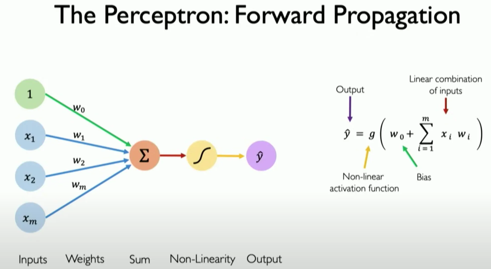

# micrograd 
A tiny autograd (Automatic gradient) engine.

# Forward propagation.

The forward propagation algorithm calculates a weighted sum for each Neuron 



## Activation functions

Activation functions introduce non-linearities into the model. Without activation functions, neurons would only perform linear transformations of the inputs, severely limiting the model's ability to learn and represent complex relationships in the data. In essence, activation functions allow the neural network to learn complex patterns and solve problems that require non-linear separations, making them essential for tasks like classification and regression.


# What it is backpropagation.

Backpropagation is an algorightm that efficiently evaluates the gradient of a loss function
with respects to the weights of the network. so we can iteratively evaluate the output and tune the weights of the network to minimize the loss.

## Topological sort

Topological Sort is a way of ordering the elements of a directed graph so that all dependencies are taken into account. This means that for every directed edge from node A to node B, node A comes before node B in the ordering. This is needed for backpropagation, because signals need to be propagated in a specific order to ensure accuracy.

## Loss function.

tries to measure the accuracy of the predictions. so the loss will be low if the predictions are matching the targets.

## How it works.

Backpropagation works through mathematical expressions, creating a computational graph of relationships among them, all the way down to the output. The algorithm starts at the output node and goes backwards through the computational graph, recursively applying the chain rule from calculus, evaluating the derivative of the output with respect to all internal nodes, including the inputs.

## Derivative.

Understand the base concept is key to understand backprogration, 
Wikipedia : quantifies the sensitivity of change of a function's output with respect to its input. The derivative of a function of a single variable at a chosen input value, when it exists, is the slope of the tangent line to the graph of the function at that point.


Python Example : 

```
cuadratic function to
def f(x):
  return 3*x**2-4*x+5

# How much y changes if we change x by a tiny amount h.
h = 0.001
x = -2.0

# Derivate ecuation.
y_prime = (f(xs + h) - f(xs))/h
plt.plot(xs, ys)
plt.plot(xs, y_prime)
plt.show()

```


# Math expression


# Chain rule.


So applying the chain rule we will be able to know how each weight of each neuron is affecting the output 
through the entire mathematical expression and therefore will know how the tune them and minimize the loss.